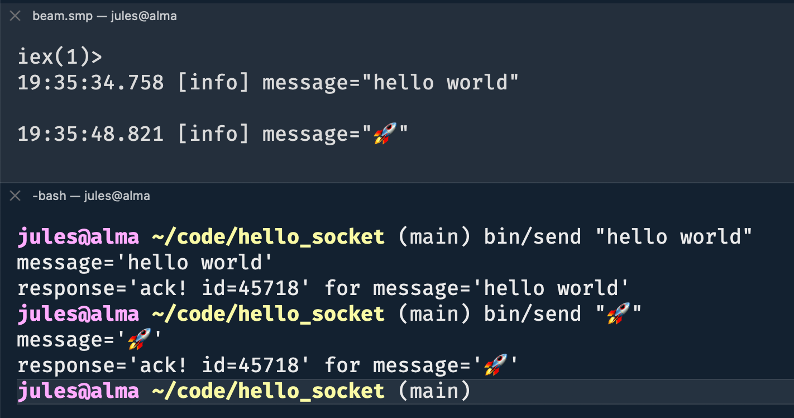

# HelloSocket

Example lightweight, supervised TCP listener and message handler (using Ranch), along with a tiny Python script to send messages to the running Elixir app from the command line.



## Usage

```bash
# start the Elixir application
# by default the TCP listener will bind to port 4000
$ iex -S mix

# in another terminal run bin/send to send messages
# note: requires python3 in path
$ bin/send "hello world"
```
